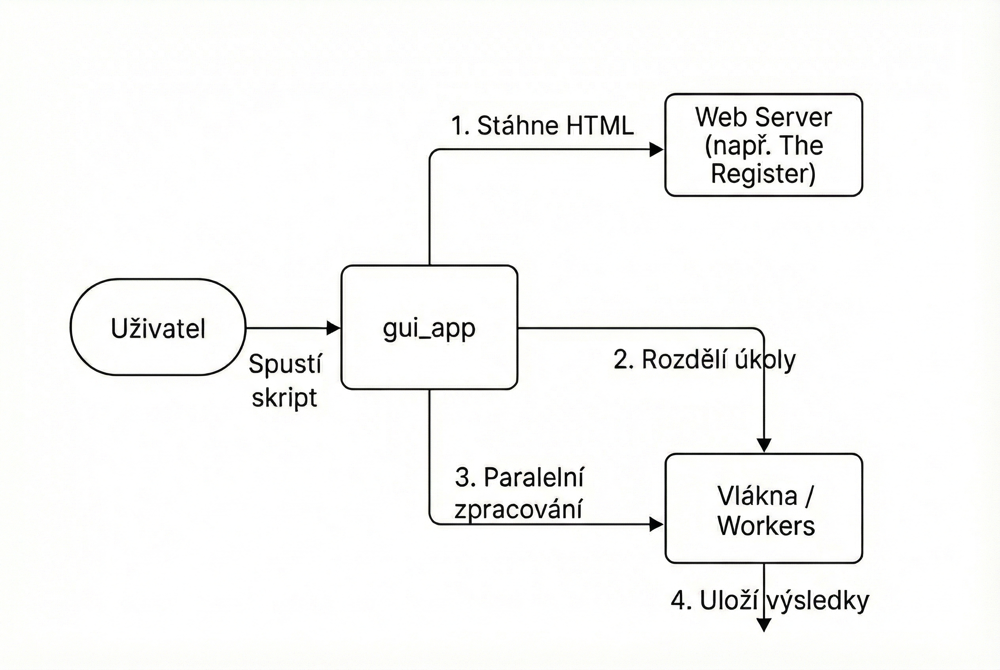

# Dokumentace projektu: Paralelní News Analyzer

| Informace | Hodnota |
| :--- | :--- |
| **Název projektu:** | Paralelní News Analyzer (The Register) |
| **Autor:** | Matěj Hodek |
| **Kontaktní údaje:** | matejhodek005@gmail.com |
| **Škola:** | SPŠE Ječná |
| **Předmět:** | Programové vybavení |
| **Datum vypracování:** | 24. 11. 2025 |
| **Typ projektu:** | **Školní projekt** |

---

## 1. Specifikace požadavků

### 1.1 Úvod
Cílem projektu je vytvoření aplikace pro **paralelní stahování a analýzu novinek** z odborného technologického serveru *The Register*. Aplikace automatizovaně vyhledává články, analyzuje jejich relevanci na základě klíčových slov a výsledky exportuje do strukturovaného souboru.

### 1.2 Funkční požadavky (Functional Requirements)
* **Stahování dat:** Aplikace se připojí k webu `theregister.com` a stáhne aktuální seznam článků.
* **Paralelizace:** Zpracování jednotlivých článků (analýza textu) probíhá paralelně ve více vláknech pro zvýšení efektivity.
* **Analýza relevance:** Každý článek je obodován na základě výskytu definovaných klíčových slov (např. AI, Cloud, Security).
* **Export dat:** Výsledky jsou uloženy do souboru `analyzed_news.csv`.
* **Ošetření chyb:** Aplikace musí zvládnout výpadky sítě, změnu struktury webu a chyby při zápisu na disk.

### 1.3 Use Case Diagram (Požadavky)
Uživatel spustí skript, který automaticky provede všechny kroky bez nutnosti další interakce.

